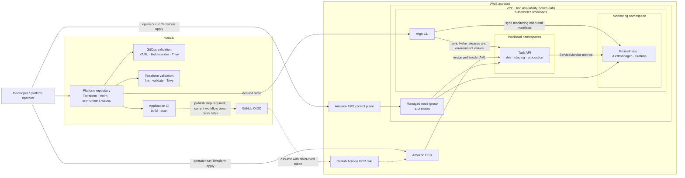

# AWS EKS GitOps Platform

[](https://github.com/baqir-ops/aws-eks-gitops-platform/actions/workflows/gitops-validation.yml)
[](https://github.com/baqir-ops/aws-eks-gitops-platform/actions/workflows/terraform-ci.yml)
[](https://github.com/baqir-ops/aws-eks-gitops-platform/actions/workflows/app-ci.yml)

A GitOps platform for deploying containerized services to Amazon EKS using **Terraform**, **Helm**, **Argo CD**, and **kube-prometheus-stack**. The repository demonstrates production-style practices in a cost-conscious lab environment; see [Production Considerations](#production-considerations) before using it for live workloads.

---

## 🏗️ Architecture Overview



Terraform provisions the AWS foundation (VPC, EKS, IAM, and ECR). Argo CD reconciles Kubernetes desired state from Git; GitHub Actions validates changes but does not itself deploy them. **Image publishing is not enabled in the current Application CI workflow** (`push: false`): a release/publish step using the configured GitHub OIDC role is required to deliver new images to ECR.

The VPC and node group shown are the current lab design, not a production topology: nodes use public subnets, NAT gateways are disabled, and the managed node group is configured for 1–2 instances. The production values enable Task API autoscaling from 2 to 5 replicas; the cluster's current node capacity may constrain that scaling.

## 📈 Production Considerations

The repository is a lab/portfolio environment, not a production-ready service deployment. To scale it safely for live traffic:

- **Scale workloads and compute together.** Production values configure the Task API HPA for 2–5 replicas at 70% CPU, but the current EKS node group is limited to 1–2 nodes. Set resource requests and limits, add pod disruption budgets and topology spread across Availability Zones, and use Cluster Autoscaler or Karpenter with tested node limits so node capacity can grow with pod demand. Separate system and application workloads onto appropriate node groups where isolation or predictable capacity matters.
- **Use private, resilient networking.** Place worker nodes in private subnets across at least two Availability Zones. Provide controlled outbound access with NAT gateways or the necessary VPC endpoints, and keep the EKS API private or tightly restricted. Add a managed ingress/load-balancing path, TLS, and appropriate edge protections before exposing services. The present public-subnet/no-NAT configuration is a cost-saving lab tradeoff.
- **Complete the image release and promotion path.** Enable the CI publish step with the existing least-privilege GitHub OIDC role, then promote immutable image digests through dev, staging, and production only after tests and approval gates pass. Keep deployment configuration changes under protected branch review, and verify that rollback restores both the image and its configuration.
- **Make state, secrets, and access production-grade.** Use encrypted, durable, access-controlled Terraform state with locking and recovery procedures. Keep secrets in AWS Secrets Manager or Systems Manager Parameter Store and deliver them through a supported external-secrets or pod-identity integration; do not commit Kubernetes Secret values. Apply least-privilege IAM/RBAC, audit access, and regularly rotate credentials and keys.
- **Remove single points of failure in operations.** The current monitoring values run single replicas and use short retention with ephemeral Prometheus storage. For production, provide persistent encrypted storage or a managed metrics backend, define backup/retention and alert-routing policies, and centralize application and audit logs. Test EKS/Kubernetes upgrades, node replacement, restore procedures, and incident runbooks against explicit availability and recovery objectives.
- **Plan capacity and cost deliberately.** Load-test representative traffic, size requests and autoscaling thresholds from observed latency and saturation, and set cluster/node scaling limits, budgets, and alerts. Validate service behavior during AZ or dependency failures; replica count alone does not provide availability if storage, networking, or downstream dependencies remain single-AZ or unprotected.

---

## 📁 Repository Directory Structure

```text
aws-eks-gitops-platform/
├── .github/workflows/          # Automated GitHub Actions validation pipelines
│   ├── app-ci.yml              # Container build, test, and security scanner
│   ├── gitops-validation.yml   # Helm rendering, contract validation & Trivy gate
│   └── terraform-ci.yml        # Terraform linting, init, and misconfiguration scans
├── app/                        # Application source code & Dockerfile
├── bootstrap/                  # Argo CD root application (App-of-Apps pattern)
├── environments/               # Environment-specific configuration overrides
│   ├── dev/values.yaml         # Development settings
│   ├── staging/values.yaml     # Staging settings
│   └── production/values.yaml  # Production settings (high availability)
├── helm/                       # Modular Helm chart definitions (task-api)
├── platform/                   # Shared cluster add-ons & observability manifests
│   └── monitoring/             # ServiceMonitors, Alertmanager rules & Grafana dashboards
├── scripts/                    # Python validation scripts for CI checks
└── terraform/                  # Infrastructure as Code (EKS, VPC, ECR, IAM)
```

---

## 🔒 Security & Governance Controls

This platform enforces strict enterprise security standards before any manifest reaches cluster deployment:

1. **Immutable Image Tagging (`sha-*`)**
   * Floating tags such as `latest` or `dev` are strictly prohibited by CI policy.
   * Every deployment must reference a deterministic Git commit SHA tag matching `sha-[0-9a-f]{40}`.

2. **Prohibition of Plain Kubernetes Secrets**
   * Plain `kind: Secret` manifests are blocked during repository validation.
   * Environment configuration relies on external secret providers or runtime injection.

3. **Automated Security & Vulnerability Gates**
   * **Trivy File System & Config Scans:** Scans infrastructure code and Helm templates for high/critical misconfigurations.
   * **Container Security:** Scans application container base images and dependencies during the `Application CI` workflow.

4. **Deterministic Helm Chart Pinning**
   * Wildcard `targetRevision` directives (e.g., `*`) are explicitly rejected by custom validation scripts to ensure environment reproducibility.

---

## 🚀 CI/CD Pipeline Suite

| Workflow | Trigger | Description |
| :--- | :--- | :--- |
| **GitOps Validation** | Push/PR to `main` | Validates custom YAML structure, enforces immutable image tags, tests Helm rendering for `dev`, `staging`, and `production`, and executes Trivy scanning. |
| **Terraform CI** | Changes in `terraform/` | Runs `terraform fmt`, validates backend setup, and scans HCL code for security compliance. |
| **Application CI** | Changes in `app/` | Builds application container images with Docker Buildx, tags them with commit SHAs, and runs vulnerability checks. |

---

## 🛠️ Local Development & Validation

You can validate the repository locally before committing using the provided scripts:

```bash
# 1. Install local Python validation dependencies
python3 -m pip install -r requirements-validation.txt

# 2. Run the GitOps state validator
python3 scripts/validate_gitops.py

# 3. Verify Helm template rendering for an environment
helm template task-api ./helm/charts/task-api --values environments/dev/values.yaml
```

---

## 📄 License
This repository is open-source and available under the **MIT License**.
