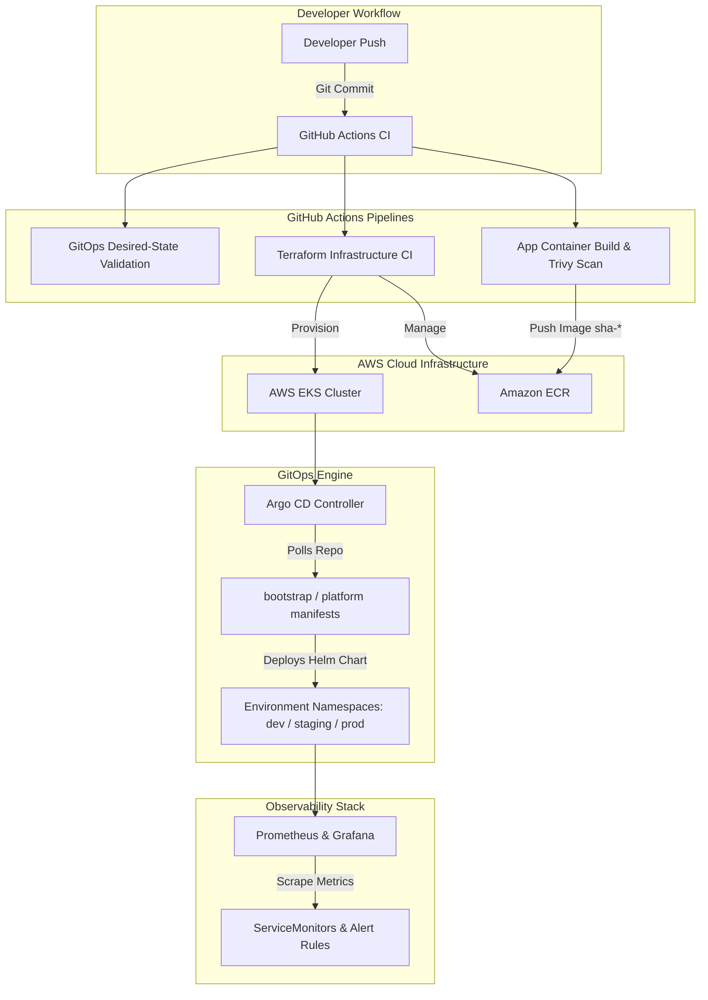

# Enterprise AWS EKS GitOps Platform

[](https://github.com/baqir-ops/aws-eks-gitops-platform/actions/workflows/gitops-validation.yml)
[](https://github.com/baqir-ops/aws-eks-gitops-platform/actions/workflows/terraform-ci.yml)
[](https://github.com/baqir-ops/aws-eks-gitops-platform/actions/workflows/app-ci.yml)

A production-ready, highly secure GitOps infrastructure platform designed for deploying microservices to Amazon EKS using **Terraform**, **Helm**, **Argo CD**, and **kube-prometheus-stack**.

---

## 🏗️ Architecture Overview



---

## 📁 Repository Directory Structure

```text
aws-eks-gitops-platform/
├── .github/workflows/          # Automated GitHub Actions validation pipelines
│   ├── app-ci.yml              # Container build, test, and security scanner
│   ├── gitops-validation.yml   # Helm rendering, contract validation & Trivy gate
│   └── terraform-ci.yml        # Terraform linting, init, and misconfiguration scans
├── app/                        # Application source code & Dockerfile
├── bootstrap/                  # Argo CD root application (App-of-Apps pattern)
├── environments/               # Environment-specific configuration overrides
│   ├── dev/values.yaml         # Development settings
│   ├── staging/values.yaml     # Staging settings
│   └── production/values.yaml  # Production settings (high availability)
├── helm/                       # Modular Helm chart definitions (task-api)
├── platform/                   # Shared cluster add-ons & observability manifests
│   └── monitoring/             # ServiceMonitors, Alertmanager rules & Grafana dashboards
├── scripts/                    # Python validation scripts for CI checks
└── terraform/                  # Infrastructure as Code (EKS, VPC, ECR, IAM)
```

---

## 🔒 Security & Governance Controls

This platform enforces strict enterprise security standards before any manifest reaches cluster deployment:

1. **Immutable Image Tagging (`sha-*`)**
   * Floating tags such as `latest` or `dev` are strictly prohibited by CI policy.
   * Every deployment must reference a deterministic Git commit SHA tag matching `sha-[0-9a-f]{40}`.

2. **Prohibition of Plain Kubernetes Secrets**
   * Plain `kind: Secret` manifests are blocked during repository validation.
   * Environment configuration relies on external secret providers or runtime injection.

3. **Automated Security & Vulnerability Gates**
   * **Trivy File System & Config Scans:** Scans infrastructure code and Helm templates for high/critical misconfigurations.
   * **Container Security:** Scans application container base images and dependencies during the `Application CI` workflow.

4. **Deterministic Helm Chart Pinning**
   * Wildcard `targetRevision` directives (e.g., `*`) are explicitly rejected by custom validation scripts to ensure environment reproducibility.

---

## 🚀 CI/CD Pipeline Suite

| Workflow | Trigger | Description |
| :--- | :--- | :--- |
| **GitOps Validation** | Push/PR to `main` | Validates custom YAML structure, enforces immutable image tags, tests Helm rendering for `dev`, `staging`, and `production`, and executes Trivy scanning. |
| **Terraform CI** | Changes in `terraform/` | Runs `terraform fmt`, validates backend setup, and scans HCL code for security compliance. |
| **Application CI** | Changes in `app/` | Builds application container images with Docker Buildx, tags them with commit SHAs, and runs vulnerability checks. |

---

## 🛠️ Local Development & Validation

You can validate the repository locally before committing using the provided scripts:

```bash
# 1. Install local Python validation dependencies
python3 -m pip install -r requirements-validation.txt

# 2. Run the GitOps state validator
python3 scripts/validate_gitops.py

# 3. Verify Helm template rendering for an environment
helm template task-api ./helm/charts/task-api --values environments/dev/values.yaml
```

---

## 📄 License
This repository is open-source and available under the **MIT License**.
